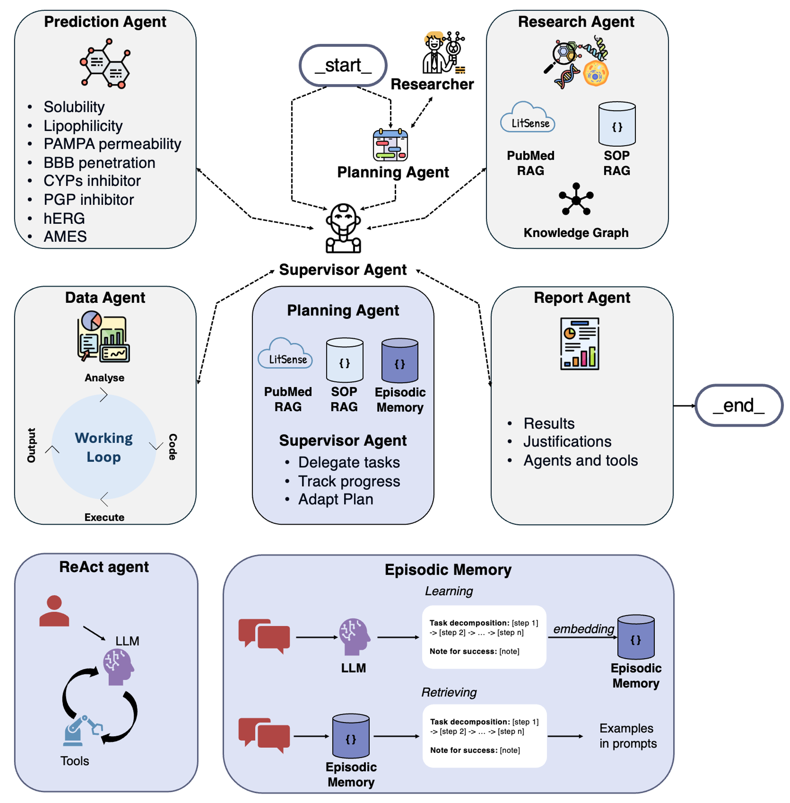

# Repuragent - An AI Scientist for Drug Repurposing

## IMPORTANT
This branch is a web-app version of the main branch, used to deploy the web app to multiple users.

## Overview

Drug repurposing offers an efficient strategy to accelerate therapeutic discovery by identifying new indications for existing drugs. However, the process remains hindered by the heterogeneity of biological and chemical data and the difficulty of forming early, evidence-based hypotheses about candidate drugs, targets, and clinical endpoints. We introduce Repuragent (Drug Repurposing Agentic System), a proof-of-concept multi-agent framework designed to autonomously plan, execute, and refine data-driven repurposing workflows under human-in-the-loop supervision. The system integrates autonomous research, data extraction, knowledge graph (KG) construction, and analytical reasoning with an adaptive long-term memory mechanism that improves the system over time.

  

### Demo Page with example output:
[RepurAgent Demo Page](https://repuragent.streamlit.app) with example output for a COVID-19 repurposing.

### Core Agent Architecture

- **Planning Agent**: Decomposes complex tasks using episodic memory learning, Standard Operating Procedures (SOPs), and academic publications.
- **Supervisor Agent**: Delegate tasks to specialized agents and track the complete status of the whole task sequence.
- **Research Agent**: Performs literature mining via PubMed, accesses knowledge graphs, and integrates biomedical databases.
- **Prediction Agent**: Executes molecular property predictions using pre-trained ML models for ADMET properties
- **Data Agent**: Manages multi-format data processing, SMILES standardization, and visualization
- **Report Agent**: Generates comprehensive analytical reports and visualizations

### Advanced Memory Systems

- **Episodic Memory**: Pattern extraction from successful executions to improve future planning
- **Short-term Memory**: Postgres-based conversation persistence with thread management
- **SOP RAG System**: Retrieval-augmented generation using professional Standard Operating Procedures
