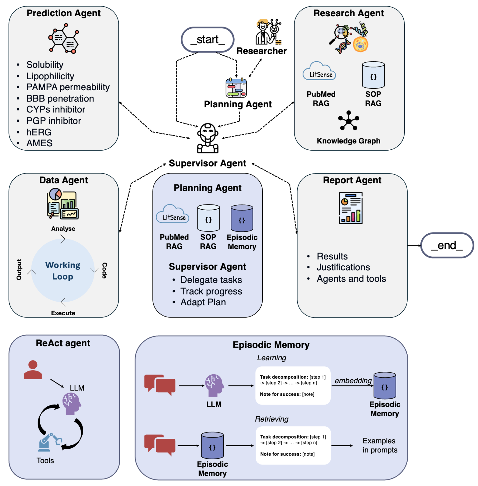

# Repuragent - An AI Scientist for Drug Repurposing

## Overview

Drug repurposing offers an efficient strategy to accelerate therapeutic discovery by identifying new indications for existing drugs. However, the process remains hindered by the heterogeneity of biological and chemical data and by the difficulty of forming early, evidence-based hypotheses about candidate drugs, targets, and clinical endpoints. We introduce Repuragent (Drug Repurposing Agentic System), a proof-of-concept multi-agent framework designed to autonomously plan, execute, and refine data-driven repurposing workflows under human-in-the-loop supervision. The system integrates autonomous research, data extraction, knowledge graph (KG) construction, and analytical reasoning with an adaptive long-term memory mechanism that improves the system over time.

<div align="center">
  
</div>

This repository is the **web application source code**. You will need both an OpenAI API key and a Postgres database in order to run it. We offer a hosted instance at [Repuragent Web](https://repuragent.serve.scilifelab.se). That instance is currently running; an account is required and resources are limited. Registration requests are verified and approved manually, so approval can take some time.

We also offer a local version, which you can clone and run on your own machine. Every file, database and conversation history stays on your device. You can find its source code at [Repuragent Local on GitHub](https://github.com/pharmbio/repuragent).

## Version announcement: Version 2

Version 2 keeps the same core engine as Version 1 but revises the planning control mechanism and how it is presented:

- **The plan is stored and updated as a file, not as prose held by the supervisor:** the supervisor writes and updates `plan.md` in the
  conversation's output folder, so progress cannot drift from what actually happened,
  a task can be resumed, and a follow-up can read the work log. This enforces deterministic plan monitoring.
- **UI/UX: a persistent task monitor:** a separate block in the UI shows which step you are on while a run is still going.
- **Context isolation:** the supervisor holds the whole conversation, and each specialist receives
  a written brief from it. When a sub-agent finishes its job, it returns only its final message to the supervisor's context.
- **A rebuilt SOP search:** an ensemble retriever fuses a BM25 arm and a ParentDocument
  dense arm over the same passages. The number of SOPs has also increased from 4 to 11 documents (the full set of
  currently available REMEDi4ALL SOPs).

## System architecture

### The agents

- **Planning agent:** decomposes the request into an executable breakdown, using standard
  operating procedures, literature, and precedent from earlier successful runs.
- **Supervisor agent:** writes a task brief for each step, delegates it to the appropriate sub-agent,
  checks what comes back, and updates `plan.md`.
- **Research agent:** performs literature search, SOP retrieval, and disease-identifier resolution; builds
  knowledge graphs from OpenTargets, ChEMBL, UniProt, Reactome, KEGG and GWAS
  data; and mines those graphs for drugs, proteins, pathways and mechanisms.
- **Prediction agent:** executes pre-trained CPSign ADMET models (CYP inhibition, hERG, Ames, P-gp, PAMPA, BBB, solubility, lipophilicity).
- **Data agent:** inspects uploads, combines tables, scores and ranks
  candidates, computes statistics, and generates figures.
- **Report agent:** summarizes the full run into the final answer, tied to the evidence the run produced.

### Memory

- **Episodic memory:** records how successful tasks were decomposed, and retrieves them as precedent when
  planning a similar one. Recording an episode is deliberate: press *Remember this plan*.
- **Conversation state:** checkpointed in SQLite, so a conversation survives a restart
  and a plan can wait at its approval gate indefinitely.
- **SOP retrieval:** a prebuilt index over regulatory guidance and protocol documents. Add a document by dropping
  the PDF into `persistence/data/SOP` and running `python reindex.py` there.

## Quick start

### Prerequisites
- [Docker Desktop](https://www.docker.com/products/docker-desktop/).
- An OpenAI API key from [platform.openai.com](https://platform.openai.com/).
- Supabase Postgres database URL
- (Optional) A LangSmith account for tracing, from [smith.langchain.com](https://smith.langchain.com/).

### Run with Docker

```bash
git clone https://github.com/pharmbio/repuragent-web.git
cd repuragent-web
cp .env.example .env        # then put your mandatory keys in it

docker build --platform linux/amd64 -t repuragent:trial .       # Build Docker Image

docker run --rm -it --env-file .env -p 7860:7860 repuragent:trial     # Run Docker Image
```

Open [http://localhost:7860](http://localhost:7860).


## Project structure

```
repuragent/
├── app/           Gradio UI, the run loop, conversations, downloads
├── core/          the agent graph (core/agents/), prompts, and every agent-facing tool (core/tools/)
├── backend/       the database, the SOP retrieval system, the sandbox, domain API clients
├── persistence/   everything that survives a restart: your conversations, the database,
│                  uploads, results, the SOP corpus and its prebuilt index
├── models/        pre-trained CPSign ADMET models
└── main.py        entry point
```

## Cite

```bibtex
@article{huynh2026repuragent,
  title   = {Human-supervised Agentic AI for Hypothesis Generation and Experimental Assistance in Drug Repurposing},
  author  = {Huynh, Dinh Long and Asp, Elin and Ballante, Flavio and Carreras Puigvert, Jordi and DeGrave, Alisa and Karki, Reagon and Nader, Kristen and {\"O}stling, P{\"a}ivi and Pokharel, Bishab and Rietdijk, Jonne and Schlotawa, Lars and Schmidt, Lina and Seal, Srijit and Seashore-Ludlow, Brinton and Aittokallio, Tero and Spjuth, Ola},
  journal = {bioRxiv},
  year    = {2026},
  doi     = {10.64898/2026.04.20.719538},
  url     = {https://www.biorxiv.org/content/10.64898/2026.04.20.719538v2},
  note    = {Preprint, version 2}
}
```