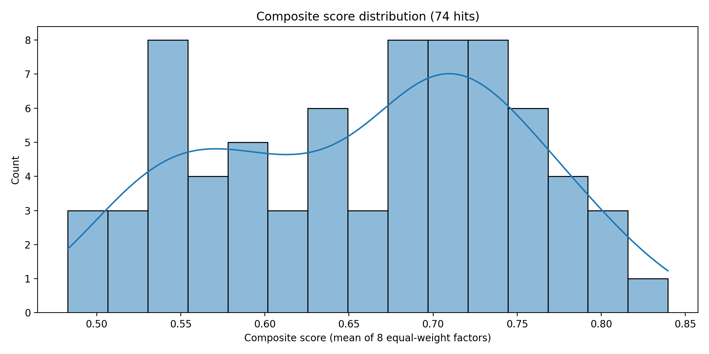

# COVID-19 repurposing prioritization of 74 validation hits

## Inputs
Experimental assay files:
- Primary VeroE6: CPE (cytopathicity rescue), Cell Painting (morphology score), Antibody-based infection readout.
- Validation A549-ACE2: Cell Painting + infection readout.
- Phospholipidosis (PLD) counter-screen (A549-ACE2 / related): 24h_DIPL(%) and classification.

Annotation sources (ChEMBL-derived; produced by Research Agent):
- `annotations_drugs_info.xlsx` (phase/approval, basic physchem)
- `annotations_drugs_moa.xlsx` (mechanism-of-action text)
- `annotations_drugs_assay_targets_info.xlsx` (targets, UniProt when available)

## Step 1 — Read/understand each dataset (profiling summary)
- 74_hits.csv contained **73** unique ChEMBL IDs (one fewer than expected; likely one compound removed upstream or naming mismatch).
- Primary CPE raw: 26,471 rows (many compounds beyond the 74 hits) with concentration (nM), *Inhibition of cytopathicity (%)* and *Non-infected cell viability (%)*.
- Primary CP/AB raw: 5,275 rows with concentration (µM), *Morphology score* and *Infection rate (%)*.
- Validation CP raw: 1,278 rows with concentration (µM), *morphology_score*, *CellCount*, and *Infection rate (%)*.
- PLD raw: 1,783 rows with concentration (µM), *24h_DIPL(%)* and a categorical classification.

Raw sheets included a few metadata rows in assay columns (e.g., 'Assay', 'Readout'); these were removed during cleaning.

## Step 2 — Data reduction to compound-level evidence
For each assay table, readouts were aggregated per compound across tested concentrations as: mean / max / min.
Key values used for scoring:
- CPE efficacy: `cpe_inhib_mean` (higher better)
- Infection inhibition (derived): `infection_inhib_*_mean = 100 - infection_rate_*_mean` (higher better)
- Morphology rescue: `morph_score_*_mean` (higher better)
- PLD induction magnitude: `abs(dipl_24h_mean)` (lower better)

## Step 3 — Equal-weight ranking system (8 factors)
All factors were treated with equal weight as requested. Each sub-score is scaled to **0–1** and the **composite score** is their arithmetic mean.

Sub-scores:
- **A (Assay efficacy):** mean of min-max normalized efficacy readouts available for the compound across assays.
- **B (Assay consistency):** combines (i) low variance across normalized efficacy readouts and (ii) evidence present in human A549-ACE2 validation (boost).
- **C (PLD confounder):** `1 - minmax(abs(dipl_24h_mean))`; missing PLD set to 0.5.
- **D (Safety/off-target proxy):** due to lack of curated safety labels in the provided annotations, this was approximated using Ro5 violations (from ChEMBL when available, otherwise computed from RDKit descriptors).
- **E (Clinical readiness):** mapped from ChEMBL `max_phase` (4→1.0, 3→0.8, 2→0.6, 1→0.4, 0/NA→0.2).
- **F (Mechanistic support proxy):** 0.7 if any ChEMBL MoA or annotated targets exist; else 0.3. (A more specific target-to-COVID linkage requires external curation and would improve this term.)
- **G (Drug-likeness):** penalty for Ro5 violations plus additional penalties for extreme logP.
- **H (Novelty):** not computable from the provided files without additional literature queries per compound; set to neutral 0.5 for all compounds.

Tie-breakers: higher **F** then higher **E**.

### Confounder flags
- `PLD_high_risk`: PLD magnitude in the top half of observed PLD induction among compounds with PLD data.
- `Cell_line_divergence`: strong primary effect but weak validation effect.
- `Clinical_ready`: max_phase ≥ 3.

## Results

### Top 20 ranked compounds (with sub-score breakdown)
| compound_name        | chembl_id     |   composite_score |   A_assay_efficacy |   B_consistency |   C_PLD |   D_safety_proxy |   E_clinical |   F_mechanism_proxy |   G_druglikeness |   H_novelty | PLD_high_risk   | Clinical_ready   | Cell_line_divergence   |
|:---------------------|:--------------|------------------:|-------------------:|----------------:|--------:|-----------------:|-------------:|--------------------:|-----------------:|------------:|:----------------|:-----------------|:-----------------------|
| disulfiram           | CHEMBL964     |             0.84  |              0.625 |           0.914 |   0.978 |              1   |          1   |                 0.7 |            1     |         0.5 | False           | True             | False                  |
| biperiden            | CHEMBL1101    |             0.807 |              0.432 |           0.936 |   0.888 |              1   |          1   |                 0.7 |            1     |         0.5 | False           | True             | False                  |
| dicycloverine        | CHEMBL1123    |             0.805 |              0.456 |           0.948 |   0.835 |              1   |          1   |                 0.7 |            1     |         0.5 | False           | True             | False                  |
| cycloheximide        | CHEMBL123292  |             0.797 |              0.663 |           0.931 |   0.982 |              1   |          0.6 |                 0.7 |            1     |         0.5 | False           | False            | False                  |
| balicatib            | CHEMBL371064  |             0.789 |              0.64  |           0.933 |   0.941 |              1   |          0.6 |                 0.7 |            1     |         0.5 | False           | False            | False                  |
| promethazine         | CHEMBL643     |             0.786 |              0.522 |           0.949 |   0.619 |              1   |          1   |                 0.7 |            1     |         0.5 | False           | True             | False                  |
| MONENSIN SODIUM      | CHEMBL5314365 |             0.776 |              0.78  |           0.963 |   0.971 |              0.5 |          1   |                 0.7 |            0.794 |         0.5 | False           | True             | False                  |
| benztropine-mesylate | CHEMBL1201203 |             0.775 |              0.45  |           0.918 |   0.631 |              1   |          1   |                 0.7 |            1     |         0.5 | False           | True             | False                  |
| emetine              | CHEMBL50588   |             0.768 |              0.491 |           0.5   |   0.951 |              1   |          1   |                 0.7 |            1     |         0.5 | False           | True             | False                  |
| elesclomol           | CHEMBL1972860 |             0.766 |              0.645 |           0.566 |   0.914 |              1   |          0.8 |                 0.7 |            1     |         0.5 | False           | True             | True                   |
| moxaverine           | CHEMBL2105060 |             0.757 |              0.362 |           0.916 |   0.978 |              1   |          0.6 |                 0.7 |            1     |         0.5 | False           | False            | False                  |
| calpeptin            | CHEMBL92708   |             0.754 |              0.897 |           0.983 |   0.755 |              1   |          0.2 |                 0.7 |            1     |         0.5 | False           | False            | False                  |
| SCH-900776           | CHEMBL2386889 |             0.752 |              0.444 |           0.954 |   0.818 |              1   |          0.6 |                 0.7 |            1     |         0.5 | False           | False            | False                  |
| GTS21                | CHEMBL134713  |             0.747 |              0.321 |           0.881 |   0.976 |              1   |          0.6 |                 0.7 |            1     |         0.5 | False           | False            | False                  |
| serdemetan           | CHEMBL2137530 |             0.738 |              0.583 |           0.765 |   0.757 |              1   |          0.6 |                 0.7 |            1     |         0.5 | False           | False            | False                  |
| sunitinib            | CHEMBL535     |             0.732 |              0.385 |           0.921 |   0.347 |              1   |          1   |                 0.7 |            1     |         0.5 | True            | True             | False                  |
| Y-26763              | CHEMBL1402866 |             0.731 |              0.525 |           0.93  |   0.997 |              1   |          0.2 |                 0.7 |            1     |         0.5 | False           | False            | False                  |
| BMS-566419           | CHEMBL229008  |             0.725 |              0.628 |           1     |   0.774 |              1   |          0.2 |                 0.7 |            1     |         0.5 | False           | False            | False                  |
| NS-3861              | CHEMBL5483034 |             0.723 |              0.434 |           0.966 |   0.981 |              1   |          0.2 |                 0.7 |            1     |         0.5 | False           | False            | False                  |
| butenafine           | CHEMBL990     |             0.723 |              0.405 |           0.919 |   0.987 |              0.5 |          1   |                 0.7 |            0.769 |         0.5 | False           | True             | False                  |

## Limitations (important)
1. The novelty term (H) is neutral for all compounds because per-compound COVID-19 publication counts were not computed in this run.
2. Safety/off-target risk (D) is a proxy based on drug-likeness/Ro5 because adverse event/boxed-warning fields were not present in the annotation exports.
3. Mechanistic support (F) is a proxy based on presence of MoA/targets, not direct SARS-CoV-2 biology linkage.

These limitations mean the ranking should be treated as a **data-driven prioritization using the available assay and ChEMBL metadata**, not a definitive clinical recommendation.

## Output artifacts
- Ranked table: `74_hits_ranked.csv`
- Top-5 deep dives: `top5/*.md` with plots under `top5/figures/`
