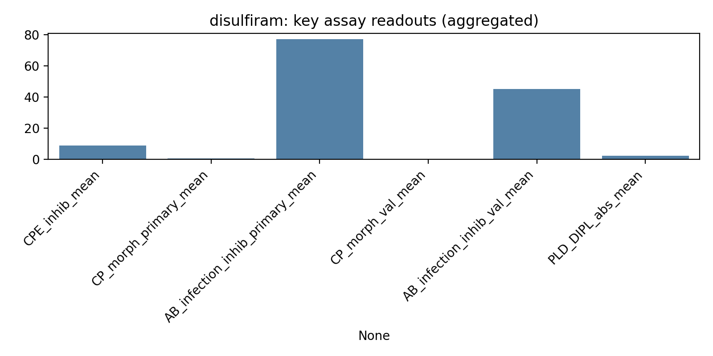
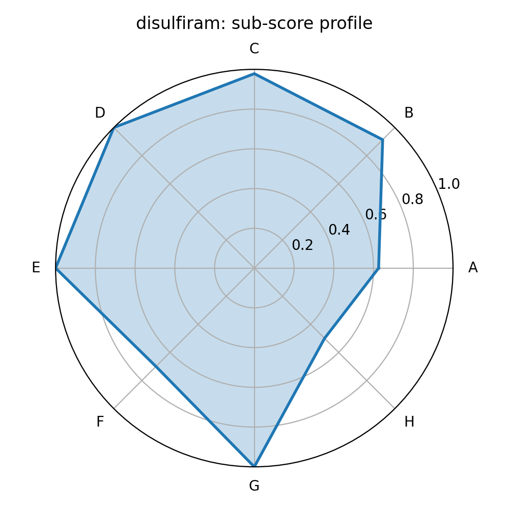

# disulfiram (Rank 1 of 73)

## Summary recommendation
This compound ranks **#1** by an equal-weight composite score (**0.840**) integrating: multi-assay antiviral phenotypes (CPE rescue, infection inhibition, morphology rescue), cross-assay consistency, phospholipidosis confounding risk, proxy safety/drug-likeness, clinical readiness from ChEMBL max phase, and mechanistic annotation availability.

**Key decision drivers (data-backed):**
- **Efficacy phenotype:** strong aggregated performance across available assay readouts (see Evidence table and assay plot).
- **Human-cell validation support:** present.
- **PLD risk:** not flagged / lower relative PLD in this set based on the PLD counter-screen.
- **Clinical readiness:** ChEMBL max phase = 4.0.

## Evidence from provided assays (aggregated across concentrations)
| Metric                                   |   Value |
|:-----------------------------------------|--------:|
| Composite score                          |   0.84  |
| CPE inhibition mean (%)                  |   8.948 |
| CPE viability mean (%)                   | 100.443 |
| Primary CP morphology mean               |   0.548 |
| Primary infection inhibition mean (%)    |  77     |
| Validation CP morphology mean            |   0.438 |
| Validation infection inhibition mean (%) |  45.25  |
| PLD 24h DIPL mean (%)                    |   2.293 |

### Visual evidence

## Sub-score profile (0–1; equal weight)
| Sub-score         |   Value |
|:------------------|--------:|
| A_assay_efficacy  |   0.625 |
| B_consistency     |   0.914 |
| C_PLD             |   0.978 |
| D_safety_proxy    |   1     |
| E_clinical        |   1     |
| F_mechanism_proxy |   0.7   |
| G_druglikeness    |   1     |
| H_novelty         |   0.5   |

## Mechanistic / annotation context (ChEMBL-derived)
- **Preferred name:** DISULFIRAM
- **MoA (if available):** INHIBITOR: Aldehyde dehydrogenase inhibitor; target=CHEMBL1935
- **Top annotated targets:** Lysyl oxidase homolog 4 | Lysyl oxidase homolog 3 | Aldehyde dehydrogenase 1A1 | Lysyl oxidase homolog 2 | Adenosine receptor A3
- **UniProt IDs (if available):** NA

## Confounders & risks (interpretation)
- **Phospholipidosis:** DIPL is a known confounder in SARS-CoV-2 repurposing screens; compounds with strong PLD signals should be treated cautiously and prioritized only if antiviral effects are clearly separable from PLD.
- **Cell-line divergence:** not flagged by the simple heuristic used.

## Suggested next experiments
1. Confirm antiviral potency with full dose–response in A549-ACE2 and a second human airway model (e.g., Calu-3), and compare antiviral window vs cytotoxicity.
2. If PLD-high-risk: demonstrate antiviral effect persists under conditions controlling for lysosomotropic PLD mechanisms (timing, counterscreens, orthogonal readouts).
3. If clinically advanced/approved: evaluate exposure feasibility (lung-relevant concentrations) and drug–drug interaction risk.
