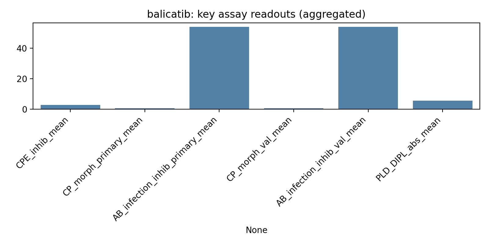
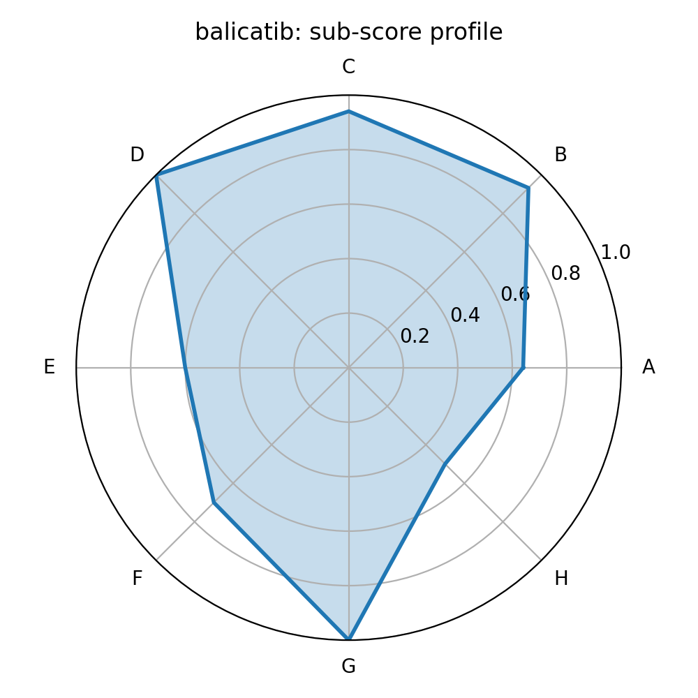

# balicatib (Rank 5 of 73)

## Summary recommendation
This compound ranks **#5** by an equal-weight composite score (**0.789**) integrating: multi-assay antiviral phenotypes (CPE rescue, infection inhibition, morphology rescue), cross-assay consistency, phospholipidosis confounding risk, proxy safety/drug-likeness, clinical readiness from ChEMBL max phase, and mechanistic annotation availability.

**Key decision drivers (data-backed):**
- **Efficacy phenotype:** strong aggregated performance across available assay readouts (see Evidence table and assay plot).
- **Human-cell validation support:** present.
- **PLD risk:** not flagged / lower relative PLD in this set based on the PLD counter-screen.
- **Clinical readiness:** ChEMBL max phase = 2.0.

## Evidence from provided assays (aggregated across concentrations)
| Metric                                   |   Value |
|:-----------------------------------------|--------:|
| Composite score                          |   0.789 |
| CPE inhibition mean (%)                  |   2.796 |
| CPE viability mean (%)                   | 103.955 |
| Primary CP morphology mean               |   0.59  |
| Primary infection inhibition mean (%)    |  54     |
| Validation CP morphology mean            |   0.69  |
| Validation infection inhibition mean (%) |  54     |
| PLD 24h DIPL mean (%)                    |   5.69  |

### Visual evidence

## Sub-score profile (0–1; equal weight)
| Sub-score         |   Value |
|:------------------|--------:|
| A_assay_efficacy  |   0.64  |
| B_consistency     |   0.933 |
| C_PLD             |   0.941 |
| D_safety_proxy    |   1     |
| E_clinical        |   0.6   |
| F_mechanism_proxy |   0.7   |
| G_druglikeness    |   1     |
| H_novelty         |   0.5   |

## Mechanistic / annotation context (ChEMBL-derived)
- **Preferred name:** BALICATIB
- **MoA (if available):** INHIBITOR: Cathepsin K inhibitor; target=CHEMBL268
- **Top annotated targets:** Cathepsin K | Cathepsin D | Procathepsin L | Cathepsin B | Cathepsin S
- **UniProt IDs (if available):** NA

## Confounders & risks (interpretation)
- **Phospholipidosis:** DIPL is a known confounder in SARS-CoV-2 repurposing screens; compounds with strong PLD signals should be treated cautiously and prioritized only if antiviral effects are clearly separable from PLD.
- **Cell-line divergence:** not flagged by the simple heuristic used.

## Suggested next experiments
1. Confirm antiviral potency with full dose–response in A549-ACE2 and a second human airway model (e.g., Calu-3), and compare antiviral window vs cytotoxicity.
2. If PLD-high-risk: demonstrate antiviral effect persists under conditions controlling for lysosomotropic PLD mechanisms (timing, counterscreens, orthogonal readouts).
3. If clinically advanced/approved: evaluate exposure feasibility (lung-relevant concentrations) and drug–drug interaction risk.
